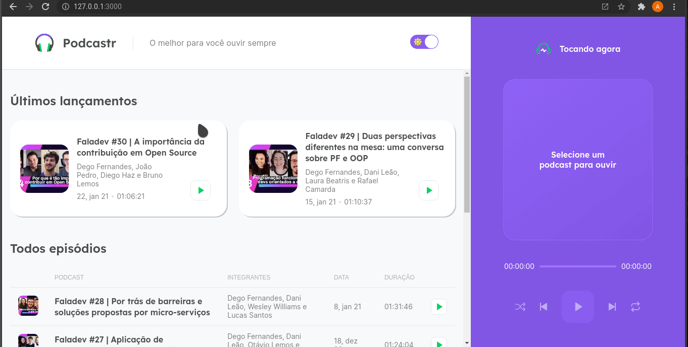

<h1 align="center">
   
</h1>

 

This project was developed during the fifth edition of the online event called [NextLeveLWeek](https://nextlevelweek.com) ministred by [RocketSeat](https://github.com/Rocketseat)

## ⚡️ The Project
  The Podcastr project is a platform where people can listen to their favorite podcasts. 
  
## 🎯 Features
 - Dinamic lists based on FAKE API data
 - API Conection via AXIOS
 - Static Site Generation
 - Light and Dark theme
  
## 🖥️ Used Tecnologies
 - [ReactJs](https://reactjs.org/)
 - [NextJs](https://nextjs.org/)
 - [Styled-Components](https://styled-components.com/)
 - [Next-PWA](https://github.com/shadowwalker/next-pwa#readme)
 - [Axios](https://axios-http.com/docs/intro)

## ⚙️ Dependencies
 - [Yarn](https://yarnpkg.com/)
 - [Json-Server](https://github.com/typicode/json-server)
 
## 🚀️ Getting Started

1. Clone this repository: 

```bash
git clone https://github.com/avnerjose/react-native-nlw-5-plantmanager.git
```
2. Go to the folder you cloned the repository and install all dependencies

```bash
yarn
```
3. Start the server
```base
yarn server
```
4. Start the app
```bash
yarn dev
```
5. Go to the file localhost:3000 to see the app working
